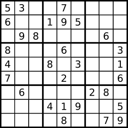
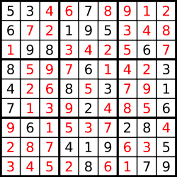

# Sudoku interview test

## Introduction

Sudoku is a Japanese game, the purpose of the game is simple, following 3 simple rules,
you start from a partially filled board and you need to fill it fully.

Only one solution exists for each partially filled board.

The board is composed by `9x9` cells, the board is divided in 9 `3x3` boxes.



The rules are the following:

1. Each number from `1 to 9` must occur in every row
2. Each number from `1 to 9` must occur in every column
3. Each number from `1 to 9` must occur in every `3x3` box

The only valid solution for the sudoku combination above is:



## Test

We really like Sudoku and we wanted to write a script that solves it for us, we started writing it, but we got stuck and
we don't know how to complete.

In this test you will try to complete the missing parts of the script, so it will produce a valid output.

## Input definition

The function `solveSudoku` receives as input a matrix `9x9` the matrix is composed by one-character strings,
valid values for these strings are: `123456789.`, the value '.' means that the box is not filled.

## Setup

Install the dependencies using:

```bash
yarn
```

or 

```bash
npm i
```

## Testing your solution

To test if your solution works use:

```bash
yarn test
```

or 

```bash
npm test
```